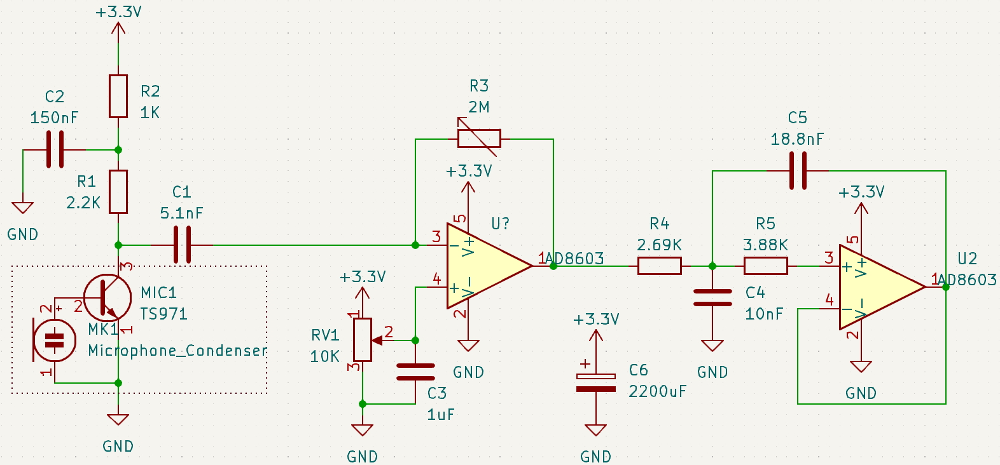

  

    Table of contents
  

  {: .text-delta }
1. TOC
{:toc}

# Microphone amplification
It is required to amplify the signal early in the circuit, for two reasons :
- the amplitude of the signal output by the integrated transistor of the microphone is < 10 mV
- it minimises the noise in the rest of the circuit

This microphone is an electret type, and requires to be polarized. 
However, the datasheet only specifies a drain resistance (2.2k $$ \Omega $$) and a voltage (2.2V), but no polarizing current. 
It was chosen that the voltage will be the one before the resistance, but both cases seemed to work.
This polarization induces a voltage offset of about 1.65V, present in the ouput of the microphone. 
This offset can't be amplified, which would saturate the amplifier.
Furthermore, filter the DC signal by a capacitor wouldn't be enough, as our amplifier is single supply, which wouldn't amplify any signal under 0V. 

For those reasons, an inverting amplifier with an offset was used (adding the same offset as the input).

The potentiometer R3 allows the ajustment of the gain, if one wants to place the emitter close or far from the microphone, without saturation.
A high gain also amplifies the ambiant noise, as the microphone isn't directional, which tends to lower the fidelity of the communication chain.
C2 and C3 are filtering capacitors, while C1 removes the DC offset.  

More performant circuits do exist, but the implementation of this one was deemed enough for this project, as it worked well enough.

# Filtering

Three capacitors have been used to filter DC voltages : C2, C3 and C6.
The cutoff frequency of the filtered voltage dividor consisting of R1, R2 and C2 is $$ f_p = frac{1}{2\pi \times (R_1//R_2) \times C_1} = 230k Hz$$ => faut changer le condensateur pour un 100 nF.
For the dividor consisting of RV1 and C3, $$f_p = 64k Hz$$ => On peut mettre une capacité beaucoup plus grosse.
Finally, a $$ 2200 \mu F$$ was placed between the 3.3V and the GND to ensure that brief power disconnection wouldn't reboot the chip, as well as to ensure that during power spike usage from the motors, the voltage would stay constant.
