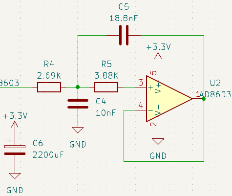
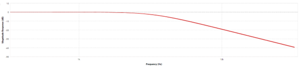
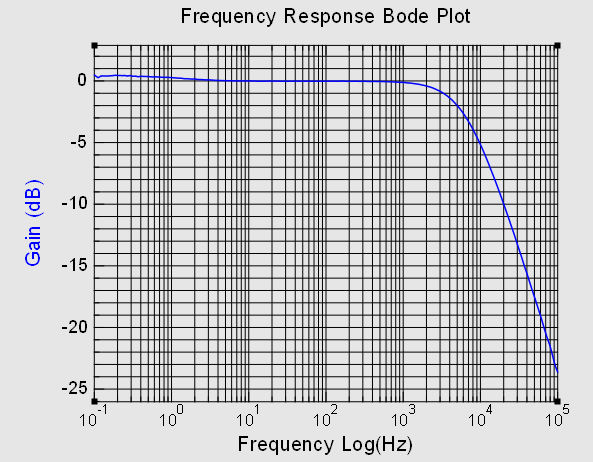
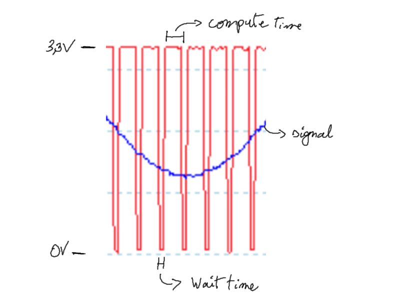

  

    Table of contents
  

  {: .text-delta }
1. TOC
{:toc}

# Analog filter

Digital processing means sampling, which means spectral aliasing. In order to compensate for this phenomenon (which folds all frequencies between fs/2 and fs), an anti-aliasing filter is used, with these specifications :  
- Maximum attenuation of useful frequencies: H1 = 0.99
- Minimum attenuation of the folded frequencies: H2 = 0.05
- 2nd order filter
- Butterworth filter (for its flat response)  

The implementation of this filter in the circuit is as shown :  
  

Despite theoretical performances matching the specifications :  
  

in practice, the -20 dB/decade wasn't reached :  
  

## Sampling frequency

A sampling frequency of 15 kHz had been chosen in the theoretical design (which was a mistake because folded frequencies starting at 7.5 kHz were not sufficiently attenuated). However, this frequency was retained because despite overclocking the microcontroller, the program was already approaching the chip's computational limit :  
  
When the red signal is at 3.3V, the microcontroller is performing the calculations related to the sampling. At 0V, the microcontroller is waiting. To achieve a gain of -26 dB in practice, a sampling rate > 100kHz would be required, which is not feasible.

# Criticism
A 4th order bandpass filter (with offset) centered around 1000 Hz could have been used instead of the anti-aliasing filter, to improve the performance of the prototype. This filter could have been implemented using a symmetrical dual supply amplifier. As the real world performance was acceptable, it was decided not to over-engineer the project.  

It is possible to combine amplification and filter into one amplifier, but this would have required a bandwidth gain product of several MHz.  

It is possible to approach performance closer to theory, probably by changing the amplifier to improve the performance (the cut-off frequency is correct, but the slope is not steep enough).
