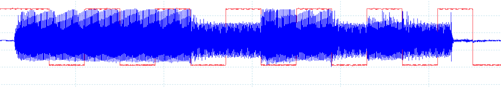
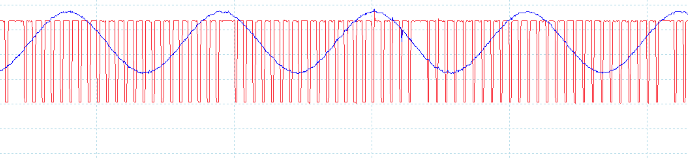

  

    Table of contents
  

  {: .text-delta }
1. TOC
{:toc}

# Results of the audio chain

Here are some challenges faced during the implementation of the filters/amplification, as well as a brief discussion of the performance reached.  

## Bit length

  
In blue : the signal received (1111100110100). In red : a flag output by the dsPic that shifts after each bit has been received.  
Due to imperfections in the speaker, and probably the software used to play the sound, the audio signal doesn't reach immediately its peak amplitude.
Also, the software seems to fade out the last bit, which doesn't last 100 ms. For thoses reasons, the first bit is detected in software after 74 analysing timer periods instead of 100, and the last bit is played by the device for slightly longer.  

## Sampling inconsistencies

  
In blue : the signal received. In red : a flag that is high while the chip is computing, and low when it's waiting to sample.  
Every 18 samples, the compute time goes up, as the analysing timer is triggered. This may cause performance issues, as the filter aren't operating at a stable sampling period.  

The code could probably be optimised slightly, to reduce the analysing timer compute time. In order to greatly reduce that compute time, another algorithm should be used.  
Another solution could be to use a second microcontroller just for that.

## Performance in practice

The performance greatly varies depending on the distance between the sender and the microphone.  
Between 10 and 30 cm, the transmitted frame is 90% of the time correct.  
For distances longer than that, the gain has to be increased, which requires a very calm environment.  
At about 1m20, the frame is 60% of the time correct.