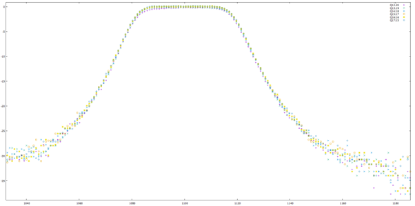

<details open markdown="block">
  <summary>
    Table of contents
  </summary>
  {: .text-delta }
1. TOC
{:toc}
</details>

# Digital filter

## Design of the filter

The specifications require a filter such that :

- Useful frequencies are within +/-1.5% of the centre frequency
- Frequencies above +/-3.5% of the centre frequency should be cut off
- Maximum attenuation of useful frequencies: H1 = 0.9
- Minimum attenuation of cut-off frequencies: H2 = 0.1  

A sampling frequency of 15 kHz was chosen for the theoretical design of the analog filter.
The filter coefficients were determined with [the provided python script](https://gitlab.com/mosee/elech309-2023/-/blob/main/tools/digitalFilterDesign.py). This script uses the signal module of the scipy library to design the filter. It starts by determining the order of the filter required (here a 4th order). The butter function is then called, which generates a numerical filter by default.  

For the filter centered around 1100 Hz :  
 

Which corresponds to this transfer function :  


## Base principle

It is possible to turn any analog filter to a digital one, using the Tustin approximation : $$ p = \frac{2}{T_s} \times \frac{z-1}{z+1} $$.
A recurring equation is then deducted from the transfer function, which was determined in the previous part. 
In terms of maths, we have :  
$$ \begin{align} & Y(z) = \frac{\sum a_k \times z^{-k}}{\sum b_k \times z^{-k}} \times X(z) \\ 
& \Leftrightarrow \sum a_k \times z^{-k}  Y(z) = \sum b_k \times z^{-k}  X(z) \\
& \Leftrightarrow \sum a_k \times z^{-k} y(n-k) = \sum b_k \times z^{-k} x(n-k)\end{align}$$

# Numerical simulation

##  Before optimizing

The filter around 1100 Hz was first simulated on MATLAB in order to take advantage of the graphical tools and the workspace system to debug the code.
The first stage was first implemented separately (in blue, the theoretical filter and in orange, the numerically simulated stage) :  


The method of simulation is to simply generate Q sines at the input, with frequencies equidistant between $$ ]0, fs/2[ $$
The output of the system is then observed in regime to determine the gain.
It was then necessary to determine whether the 4 stages of the filter were in parallel (sum of the responses of each filter), or in series (the output of one stage becomes the input of another). By simulation, it was determined that the filters were in series.  
Here is a simulation of the 4 stages of the filter centered around 1100 Hz for an input frequency of a sin of 1100 Hz :  


And for an input frequency of 1150 Hz :  


This was done to check if the filter attenuates correctly the frequencies.

## Optimizing memory

As there are 4 stages + the output, and the stages are in series, a 5x12 table was used to optimize memory :  


## Optimizing computational ressources

As floats aren't native to the microprocessor architecture, fixed point compute was used. The data type that will be used are therefore integers, stored on 32 bits. To determine how many bits to use for the integer and the fractional part, numerical simulation in C of the filters was used. The notation used is QX:Y, X being the number of bits used for the integer part, and Y for the fractional part ($$ X + Y = 32 $$).  
Between Q12:20 and Q17:15, for all values :  


For the most important values :  


For Q18:14, the maximal values of int32_t's was reached, which causes overflow :  


Q17:15 was chosen, but any repartition that doesn't ovoerflow would have been fine, as the performance doesn't seem too much affected.

# Implementation on the microcontroller
_**// je dois peut être trouver une meilleure terminologie que sampling timer psq c'est pas précis**_  
The chip is overclocked to 39.5 MHz, to allow sufficiently fast sampling.
The code starts by resetting the values in the array to 0 :  

```c
void reset_tables()
{
    for (int i = 0; i < 5; i++) {
        for (int j = 0; j < 12; j++) {
            ys_1[i][j] = 0;
            ys_2[i][j] = 0;
        }
    }
    for (int i = 0; i < 17; i++) {
        last_values_1[i] = 0;
        last_values_2[i] = 0;
    }
}

```

An infinite loop waits for the conversion of the adc (15 kHz), then calculates the output of the stages. The pointers to the array are updated :  

```c
while(1) 
    {
        if (adcConversionDone()) 
        {
            voltage = adcRead();
            if (voltage >= 4096 || voltage < 0)
            {
                continue; // starts new loop
            }
            
            ys_1[0][pointer_current] = voltage; // updates current value
            ys_2[0][pointer_current] = voltage;

            for (int k = 0; k < FLOORS; k++) // filter id
            {
                ys_1[k + 1][pointer_current] = ((gs_1[k] * ((bs_1[k][0] * ys_1[k][pointer_current] + bs_1[k][1] * ys_1[k][pointer_before] + bs_1[k][2] * ys_1[k][pointer_last]) >> M_FILTER)) - as_1[k][1] * ys_1[k + 1][pointer_before] - as_1[k][2] * ys_1[k + 1][pointer_last]) >> (M_FILTER);
                ys_2[k + 1][pointer_current] = ((gs_2[k] * ((bs_2[k][0] * ys_2[k][pointer_current] + bs_2[k][1] * ys_2[k][pointer_before] + bs_2[k][2] * ys_2[k][pointer_last]) >> M_FILTER)) - as_2[k][1] * ys_2[k + 1][pointer_before] - as_2[k][2] * ys_2[k + 1][pointer_last]) >> (M_FILTER);
            } 
            
            last_values_1[pointer_last_values] = ys_1[4][pointer_current];
            last_values_2[pointer_last_values] = ys_2[4][pointer_current];

            // updating pointers
            pointer_last = (pointer_last + 1) % 12; pointer_before = (pointer_before + 1) % 12; pointer_current = (pointer_current + 1) % 12;
            pointer_last_values = (pointer_last_values + 1) % 18;
        }
	}
	
```

In parallel, at 1000 Hz, an interrupt timer is used to analyse the array values. While this code is running, sampling does not take place. The maximum value of the two arrays (900 and 1100Hz) is recovered from the previous 18 samples (which gives at least one period of the signal). If one of the two values exceeds an experimentally determined threshold (around 300), one of the filters has detected a signal.

When a signal is detected, the chip goes into listening mode. Each time the timer is interrupted at 1000 Hz, the average_sample variable will be incremented if the 1100 Hz filter has detected a signal, and decremented if it is the 900 Hz filter. Once 99 samples have been received (normally 100 but the frequency is not exactly 1000 Hz), a bit has been received. This bit is deducted from the value of average_sample, and is sent to the FSM. If this bit is the last one of the frame, everything is reset.

Small details: due to a delay in the detection of the signal at the first bit, caused by the digital filter transient, the first bit is detected after 74 samples and not 99. Also, as can be seen in the figure (insert figure with filter stages), again due to the filter transient, some short sounds (composed of many frequencies, such as a clap) are not attenuated fast enough. During sampling, the filters then detect a signal. In order to overcome this problem, a "fluke" detection system has been implemented. A noise_counter variable counts the number of times that none of the filters detected a signal during the first bit. If this variable reaches 15/75, it is probably a fluke and the system resets.

Full code of the sampling timer : 

```c
void __attribute__((interrupt, no_auto_psv))_T1Interrupt(void)
{
    // ISR code does the same things that the main loop did in polling
    _T1IF = 0; // down the interrupt flag
    
    max_1 = 0;
    max_2 = 0;
    for (int ii = 0; ii < 18; ii++)
    {
        if (max_1 < last_values_1[ii]) max_1 = last_values_1[ii];
        if (max_2 < last_values_2[ii]) max_2 = last_values_2[ii];
    }

    filter_0 = (max_1 > THRESHOLD) ? 1 : 0;
    filter_1 = (max_2 > THRESHOLD) ? 1 : 0;

    
    if (filter_0 == 1 || filter_1 == 1)
    {
        if (sample_count == 0)
        {
            bit_count = 0;
            average_sample = 0;
            is_listening = 1;
            noise_counter = 0;
            _LATB12 = 1; _LATB4 = 0; // LEDs
        }
        
        average_sample += filter_1;
        average_sample -= filter_0;
    }
    
    if (is_listening && bit_count == 0 && sample_count < 75 && filter_0 == 0 && filter_1 == 0)
    {
        noise_counter ++;
        if (noise_counter > 15)
        {
            // probably fluke
            sample_count = 0;
            bit_count = 0;
            average_sample = 0;
            is_listening = 0; _LATB12 = 0;
            _LATB4 = 1; // LEDs
            reset_tables();
            resetFSM();
            noise_counter = 0;
        }
    }
    
    if (sample_count == 99 || (bit_count == 0 && sample_count == 74))
    {
        bit_count ++;
        sample_count = 0;

        // bit has been received
        
        _LATB14 = (average_sample > 0); // LED
        _LATB5 = (average_sample < 0); // LED

        
        // sends to FSM:
        FrameFSM(average_sample > 0);
        reset_tables();
        average_sample = 0;
        
    }
    
    if (bit_count == FRAME_LENGTH) //defined in parameters.h
    {
        sample_count = 0;
        bit_count = 0;
        average_sample = 0;
        is_listening = 0; _LATB12 = 0; _LATB14 = 0; _LATB5 = 0;
        reset_tables();
        resetFSM();
        T1CONbits.TON = 1;
    }
    
    if (is_listening)
    {
        sample_count ++;
    }
}

```

