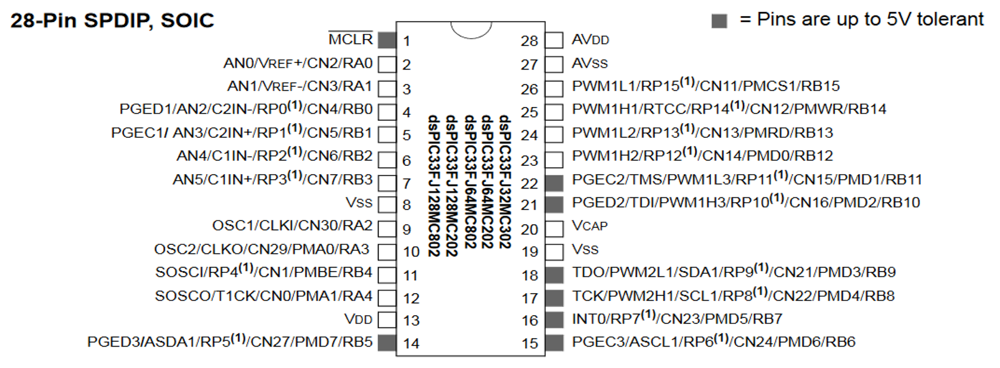

<details open markdown="block">
  <summary>
    Table of contents
  </summary>
  {: .text-delta }
1. TOC
{:toc}
</details>

# Microcontroller Configuration
The µController used is a [Microchip dsPIC33FJ128MC802](https://www.microchip.com/en-us/product/dsPIC33FJ128MC802).

## Pins Usage
Here is the used pins on the dsPIC µController, and their purpose:  


For reference, here are the pins of the dsPIC from the datasheet:  

[^1]

## Configuration Bits
These configuration bits were chosen to allow for the microcontroller's overclock.

The file in full is available [here](https://github.com/DemonicTricycle/DemonicTricycle-ELECH309/blob/main/src/configuration.c).

<details open markdown="block">
  <summary>
  configuration.c [Click to open]
  </summary>

```c
// DSPIC33FJ128MC802 Configuration Bit Settings
// 'C' source line config statements
// FBS
#pragma config BWRP = WRPROTECT_OFF // Boot Segment Write Protect (Boot Segment may be written)
#pragma config BSS = NO_FLASH       // Boot Segment Program Flash Code Protection (No Boot program Flash segment)
#pragma config RBS = NO_RAM         // Boot Segment RAM Protection (No Boot RAM)

// FSS
#pragma config SWRP = WRPROTECT_OFF // Secure Segment Program Write Protect (Secure segment may be written)
#pragma config SSS = NO_FLASH       // Secure Segment Program Flash Code Protection (No Secure Segment)
#pragma config RSS = NO_RAM         // Secure Segment Data RAM Protection (No Secure RAM)

// FGS
#pragma config GWRP = OFF // General Code Segment Write Protect (User program memory is not write-protected)
#pragma config GSS = OFF  // General Segment Code Protection (User program memory is not code-protected)

// FOSCSEL
#pragma config FNOSC = FRCPLL // Oscillator Mode (Internal Fast RC (FRC))
#pragma config IESO = OFF   // Internal External Switch Over Mode (Start-up device with FRC, then automatically switch to user-selected oscillator source when ready)

// FOSC
#pragma config POSCMD = NONE  // Primary Oscillator Source (Primary Oscillator Disabled)
#pragma config OSCIOFNC = OFF // OSC2 Pin Function (OSC2 pin has clock out function)
#pragma config IOL1WAY = ON   // Peripheral Pin Select Configuration (Allow Only One Re-configuration)
#pragma config FCKSM = CSDCMD // Clock Switching and Monitor (Both Clock Switching and Fail-Safe Clock Monitor are disabled)

// FWDT
#pragma config WDTPOST = PS32768 // Watchdog Timer Postscaler (1:32,768)
#pragma config WDTPRE = PR128    // WDT Prescaler (1:128)
#pragma config WINDIS = OFF      // Watchdog Timer Window (Watchdog Timer in Non-Window mode)
#pragma config FWDTEN = ON      // Watchdog Timer Enable (Watchdog timer enabled/disabled by user software)

// FPOR
#pragma config FPWRT = PWR128 // POR Timer Value (128ms)
#pragma config ALTI2C = OFF   // Alternate I2C  pins (I2C mapped to SDA1/SCL1 pins)
#pragma config LPOL = ON      // Motor Control PWM Low Side Polarity bit (PWM module low side output pins have active-high output polarity)
#pragma config HPOL = ON      // Motor Control PWM High Side Polarity bit (PWM module high side output pins have active-high output polarity)
#pragma config PWMPIN = ON    // Motor Control PWM Module Pin Mode bit (PWM module pins controlled by PORT register at device Reset)

// FICD
#pragma config ICS = PGD1   // Comm Channel Select (Communicate on PGC1/EMUC1 and PGD1/EMUD1)
#pragma config JTAGEN = OFF // JTAG Port Enable (JTAG is Disabled)

```

</details>
  
----

[^1]: Image from [Microchip](https://www.microchip.com/en-us/product/dsPIC33FJ128MC802)'s [dsPIC33FJ128MC802 datasheet](https://ww1.microchip.com/downloads/aemDocuments/documents/OTH/ProductDocuments/DataSheets/70291G.pdf)
