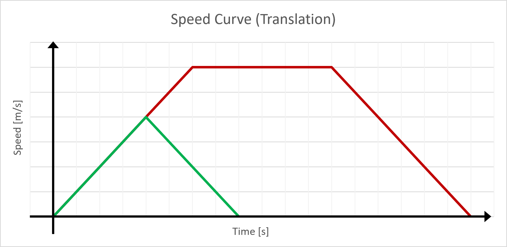
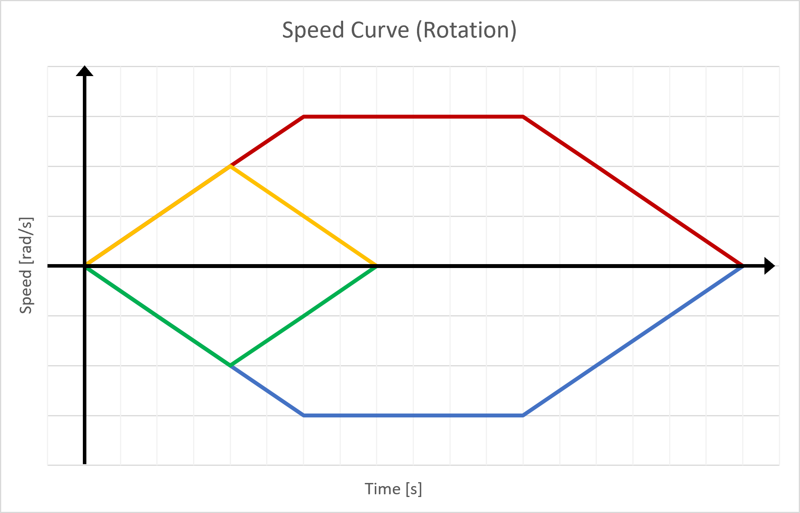
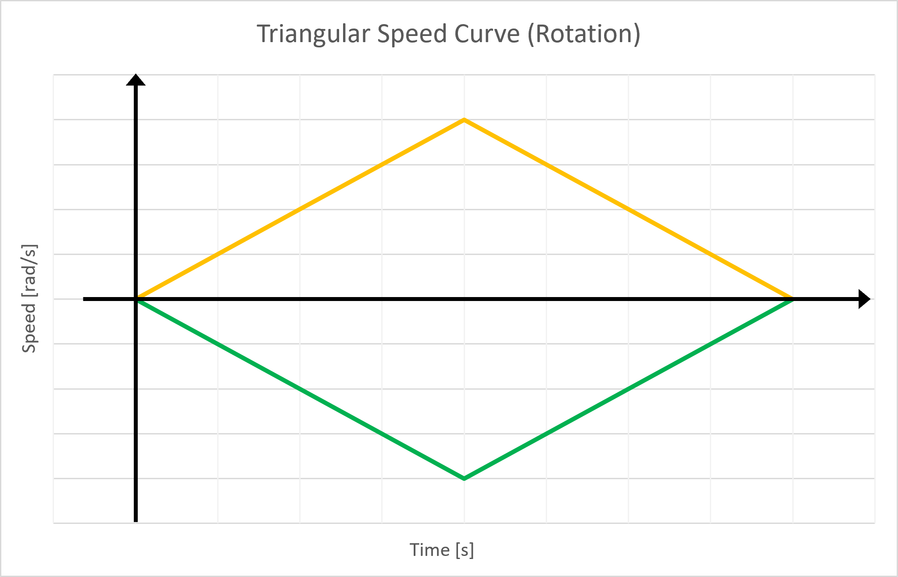

<details open markdown="block">
  <summary>
    Table of contents
  </summary>
  {: .text-delta }
1. TOC
{:toc}
</details>

# Motor Regulation

## Regulation loop
The regulation loop is made using a simple proportional regulator. 
The position of the robot is obtained using the quadrature encoders, the error is calculated, and the motor’s DC input voltage is regulated accordingly using the PWM signal generated by the dsPIC. The PWM can be used without issues because the motor's time constant is much larger than the PWM's time period.
[^1]  

## Target Generation

For a translation, the speed must follow this trapezoidal curve:  



If the distance is 0.5m or less, it won't be possible to reach the desired cruise translation speed in the available time. 
In such cases, the speed will follow a triangular curve (shown in green on the illustration), and both of these scenarios need to be accounted for in the code.
To follow this curve, the code uses the following function that calculates the target position based on the desired final translation and the time elapsed since the start of the movement :
<details markdown="block">
<summary>
Translation target function [Click to open]
</summary>

```c
float GetTarget(float time, float final_target) // time in s, end in m = final distance
{
    int sign = FloatSign(final_target);
    float end = FloatAbs(final_target);

    if (end < 0.5) 
    {
        float half_time = sqrt(end / 0.5);
        if (time > half_time * 2)
        {
            return end * sign;
        }
        if (time < half_time)
        {
            return (time * time * ACCELERATION / 2) * sign;
        }
        else
        {
            float distAldreadyMade = half_time * half_time * ACCELERATION / 2;
            float time_since_slowing = time - half_time;
            // TODO: set as #defines ?
            return (distAldreadyMade + 0.5 * half_time * time_since_slowing - time_since_slowing * time_since_slowing * 0.25) * sign;
        }
    }
    if (time < 1)
    {
        return (time * time * 0.25) * sign;
    }

    float time_at_cruise = (end - 0.5) / 0.5;

    if (time >= time_at_cruise + 1) // Slowing down
    {
        float time_remaining = time_at_cruise + 2 - time;
        float time_since_slowing = time - time_at_cruise - 1;

        if (time_remaining < 0)
        {
            // TODO: set as #defines ?
            return (0.5 * time_at_cruise + 0.5) * sign;
        }

        // TODO: set as #defines ?
        return (0.5 * time_at_cruise + 0.25 + 0.5 * time_since_slowing - time_since_slowing * time_since_slowing * 0.25) * sign;
    }
    // TODO: set as #defines ?
    return ((time - 1) * 0.5 + 0.25) * sign;
}
```

</details>

The output of this script gives the following plot (for a final translation of 2m):  


The target speed can be calculated from the target position, giving:  


The target speed matches the specifications, and the code can be validated.  

The same principle can be used for the rotation, with the difference that the motors turn in opposite directions:  



In order to calculate the maximum rotation that can be done without reaching the cruise rotation speed, several factors must be considered. Firstly, the maximum angle that can be transmitted is 255 degrees, which is equivalent to 4.451 radians. Secondly, the chosen maximum rotation speed is 4 radians per second. This choice was made using the same method that was used to determine the maximum translation speed, as explained in the accompanying documents.

The chosen value for the acceleration is 3.33 radians per second squared. With these factors in mind, the maximum rotation that can be accomplished without reaching the cruise rotation speed can be calculated :

$$\dot{\alpha} = 3.33 t \frac{rad}{ s^2}$$ $$\rightarrow t_{max} = \frac{\dot{\alpha}_{max }}{3.33} \frac{s^2}{rad} = \frac{4}{3.33}s $$, where $$\alpha$$ represents the angle of the robot, $$t_{max}$$ represents the time at which the cruising speed is reached.
Let $$\alpha_{tmax}$$ be the angle reached at this time,

$$\alpha = \frac{3.33}{2} t^2 rad / s^{2} \rightarrow \alpha_{tmax} = \frac{3.33}{2}  t_{max}^2 rad / s^{2}= \frac{3.33}{2} (\frac{4}{3.33})^2 rad = 2.4 rad$$

The same rotation will be made when decelerating, $$\alpha_{max} = 2*2.4 rad = 4.8 rad$$  with $$\alpha_{max}$$ representing the angle made by the robot when accelerating and decelerating.
Therefore, there is no need to implement a trapezoidal-style curve in the code as the cruising rotation speed will never be reached, making the rotation speed curve simply triangular.  



This is implemetented using the following function :


<details markdown="block">
<summary>
Rotation target function [Click to open]
</summary>

```c

float getTargetAngle(float given_angle, float time_since_start)
{

    int sign = FloatSign(given_angle);
    float target_angle = FloatAbs(given_angle);
    // Calculate the maximum angle that can be reached before reaching the cruise speed

    float angle_to_return = 0;

    if (target_angle > MAX_ANGLE)
    {
    //Unreachable
        return 0; // Such an angle is not sendable in 8 bits
    }

    float half_time = sqrt(target_angle / ACCELERATION_ROTATION); // The time at wich we start decelerating

    if (time_since_start < half_time)
    {
        // Simple acceleration
        angle_to_return = time_since_start * time_since_start * ACCELERATION_ROTATION / 2;
    }
    else
    {
        float time_since_slowing = time_since_start - half_time;
        // Distance aldready made when accelerating
        angle_to_return = half_time * half_time * ACCELERATION_ROTATION / 2;
        // Distance since deceleration
        angle_to_return += ACCELERATION_ROTATION * (half_time * time_since_slowing - time_since_slowing * time_since_slowing / 2);
    }
    if (time_since_start >= half_time * 2)
    {
        angle_to_return = target_angle;
    }

    return angle_to_return * sign;
}

```

</details>


For a rotation of 90°, the code gives the following target angle:


The target speed can be calculated from the target angle, giving:  


Which follows the specification, thus validating the code.


# Implementation on the Microcontroller
The code is available in [motors.c](https://github.com/DemonicTricycle/DemonicTricycle-ELECH309/blob/main/src/motors.c).

----

[^1]: Image from ELEC-H309, École Polytechnique de Bruxelles, ULB - [Gitlab](https://gitlab.com/mosee/elech309-2023)
